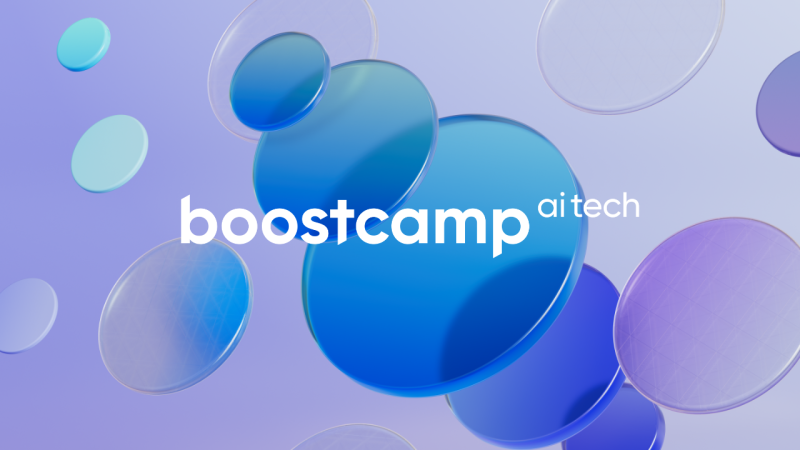

# ✅네이버 부스트캠프 AI tech 5기 활동 기록장

- 본 저장소는 `네이버 부스트캠프 AI tech 5기` 활동중 공부한 내용을 정리한 저장소입니다

## 🔥주간 학습정리 

- ✅Week 1
  -   

- ✅Week 2
  - <a href='https://eumgill98.tistory.com/49'> <a href='https://eumgill98.tistory.com/51'> <a href='https://eumgill98.tistory.com/54'> <a href='https://eumgill98.tistory.com/57'> <a href='https://eumgill98.tistory.com/58'>
  
- ✅Week 3
  - <a href='https://eumgill98.tistory.com/61'> <a href='https://eumgill98.tistory.com/62'> <a href='https://eumgill98.tistory.com/63'> <a href='https://eumgill98.tistory.com/64'> <a href='https://eumgill98.tistory.com/66'> <a href='https://eumgill98.tistory.com/67'> <a href='https://eumgill98.tistory.com/68'>
  
- ✅Week 4
  - <a href='https://eumgill98.tistory.com/71'> <a href='https://eumgill98.tistory.com/72'> <a href='https://eumgill98.tistory.com/73'> <a href='https://eumgill98.tistory.com/74'> 
  
- ✅Week 5
  - <a href='https://eumgill98.tistory.com/76'> <a href='https://eumgill98.tistory.com/77'> <a href='https://eumgill98.tistory.com/78'> <a href='https://eumgill98.tistory.com/79'> <a href='https://eumgill98.tistory.com/80'> 
  
- ✅Week 6 : level1-Image Classficiation 
  - <a href='https://eumgill98.tistory.com/82'> <a href='https://eumgill98.tistory.com/83'> 
  
- ✅Wee 7 : level1-Image Classficiation 
  - <a href='https://bottlenose-oak-2e3.notion.site/wrap-up-report-c37b3c035f82462480954c78dabbdc5c'>
  
- ✅Wee 8 :
  - <a href='https://eumgill98.tistory.com/86'> <a href='https://eumgill98.tistory.com/87'> <a href='https://eumgill98.tistory.com/88'>
  
- ✅Wee 9 ~ 11 : level 2 obejct detection
  - <a href='https://eumgill98.tistory.com/90'> <a href='https://eumgill98.tistory.com/91'> <a href='https://eumgill98.tistory.com/92'> <a href='https://eumgill98.tistory.com/93'> <a href='https://eumgill98.tistory.com/94'>

- ✅Wee 12 ~ 13 : level 2 data centric
  -    
  
## ✅주간 회고정리
-         

  
## 🔥Level 1 Team SCV🔥
  

  <b>팀 Notion : </b>

  <b>팀 회고 정리        

## ⚾ Level 2 Team 멋쟁이 ⚾
  

  <b>팀 Notion : </b>
  
    
  <b>팀 회고 정리      
   

